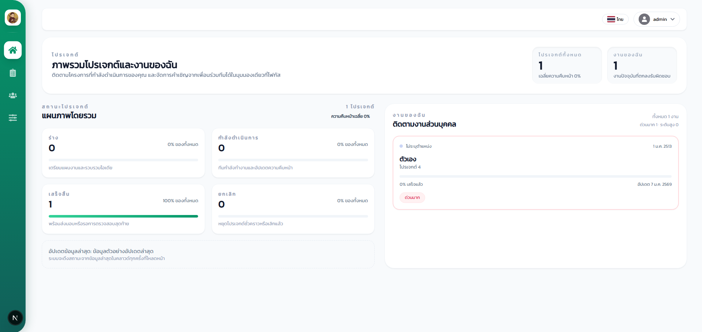
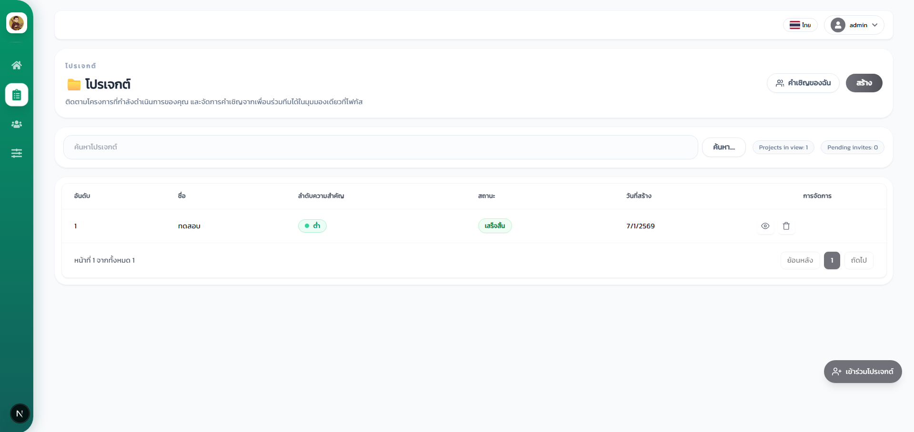
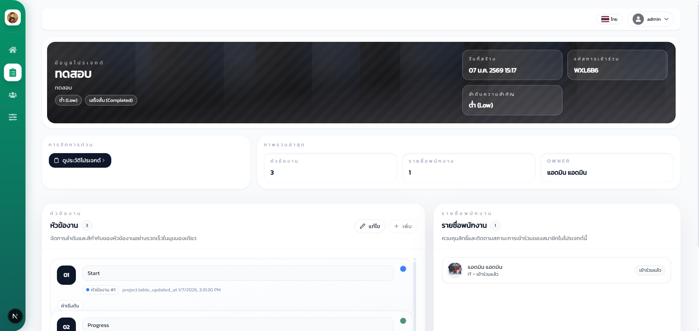
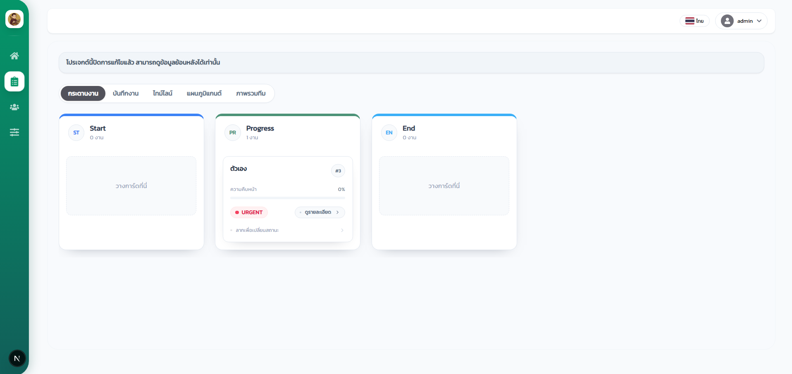
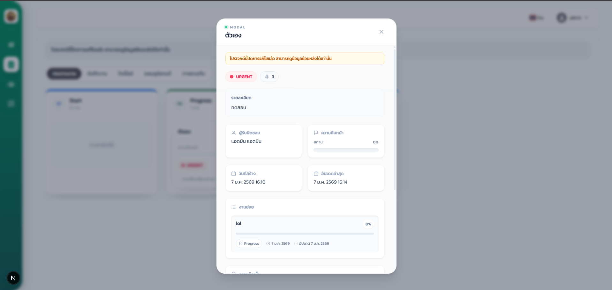
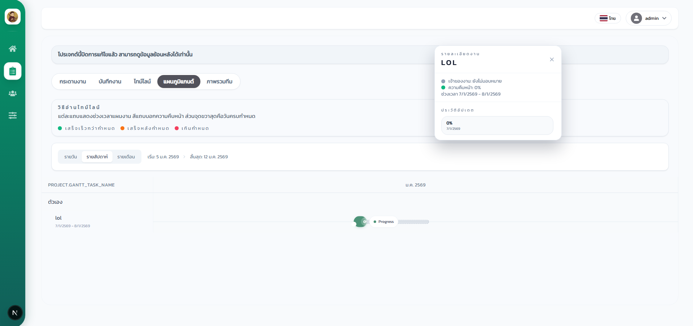
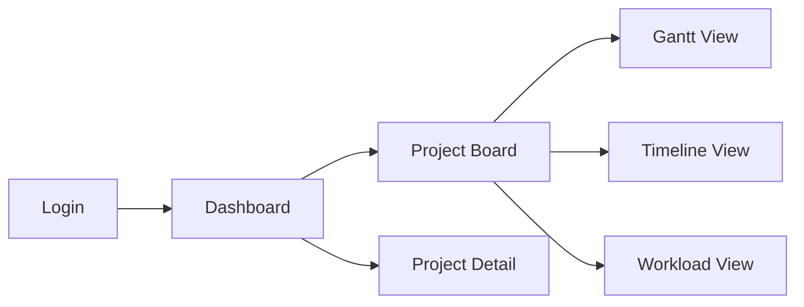

<div align="center">
  
</div>

# ระบบจัดการโปรเจกต์ (Project Management System)

เว็บแอปสำหรับจัดการโปรเจกต์และงานในทีม เน้นใช้งานง่าย มองภาพรวมได้เร็ว และติดตามความคืบหน้าของงานแต่ละคนได้แบบละเอียด ผ่านหน้าแดชบอร์ด, กระดานงาน (Board), มุมมองไทม์ไลน์ และ Gantt chart

---

## ภาพรวมสถาปัตยกรรม

- **Frontend**: [Next.js](https://nextjs.org) (App Router) + React + Tailwind CSS
  ที่เก็บโค้ดหลัก: `frontend/src/app`
- **Backend**: [NestJS](https://nestjs.com) API + Prisma ORM
  ที่เก็บโค้ดหลัก: `backend/src`
- **Database**: รองรับผ่าน Prisma (ดูโครงสร้างใน `backend/prisma/schema.prisma`)
- **Real-time**: ใช้ Socket.IO สำหรับอัปเดตบอร์ด/งานแบบเรียลไทม์ในหน้า Board

โครงสร้างโฟลเดอร์ระดับหลัก:

```text
.
├─ backend/    # REST API, Auth, Project/Task logic, Prisma
├─ frontend/   # Next.js client, Dashboard, Boards, UI
└─ database/   # ไฟล์ SQL สำรองโครงสร้าง/ข้อมูล
```

ตัวอย่างภาพหน้าแดชบอร์ด (Dashboard) ของระบบ:

<div align="center">
  
</div>

---

## ตัวอย่างหน้าจอ (Screenshots)

ภาพตัวอย่างหน้าเว็บส่วนต่าง ๆ (หน้า Dashboard / Board / Detail ฯลฯ) เพื่อให้เห็นหน้าตาระบบจริง:

<div align="center">

  
  <br />
  
  <br />
  
  <br />
  
  <br />
  
  <br />
  

</div>

---

## ฟีเจอร์หลัก

### 1. หน้าแดชบอร์ดภาพรวม (Home Dashboard)

ตำแหน่งโค้ดหลัก:
- [frontend/src/app/(dashboard)/home/view/page.tsx](file:///d:/Project%20Management%20System/frontend/src/app/(dashboard)/home/view/page.tsx)

สิ่งที่แสดงบนแดชบอร์ด:

- จำนวนโปรเจกต์ทั้งหมด และ **ความคืบหน้าเฉลี่ย** ของทุกโปรเจกต์
- จำนวน “งานของฉัน” (tasks ที่มอบหมายให้ผู้ใช้คนปัจจุบัน)
- การ์ดสรุปสถานะโปรเจกต์ เช่น
  - ร่าง (Draft)
  - กำลังดำเนินการ (Started)
  - เสร็จสิ้น (Completed)
  - ยกเลิก (Cancelled)
- ส่วน “งานของฉัน” พร้อมแสดง:
  - ชื่อโปรเจกต์, สถานะงาน, progress %
  - วันที่อัปเดตล่าสุด, กำหนดส่ง (Due date)
  - ระดับความสำคัญ (ปกติ, ระดับสูง, ด่วนมาก) พร้อมไฮไลต์ให้การ์ดที่สำคัญดูเด่นขึ้น

ภาพรวมนี้ช่วยให้ผู้ใช้เห็นทั้งระดับ **โปรเจกต์** และ **งานส่วนบุคคล** ได้ในหน้าจอเดียว

### 2. กระดานโปรเจกต์ (Boards)

ตำแหน่งโค้ดหลัก:
- [frontend/src/app/(dashboard)/boards/view/page.tsx](file:///d:/Project%20Management%20System/frontend/src/app/(dashboard)/boards/view/page.tsx)
- [frontend/src/app/(dashboard)/boards/view_board/[id]/page.tsx](file:///d:/Project%20Management%20System/frontend/src/app/(dashboard)/boards/view_board/[id]/page.tsx)
- [frontend/src/app/(dashboard)/boards/view_board/[id]/components/BoardView.tsx](file:///d:/Project%20Management%20System/frontend/src/app/(dashboard)/boards/view_board/[id]/components/BoardView.tsx)

ความสามารถหลัก:

- แสดงงานในรูปแบบคอลัมน์ตามสถานะ (เช่น To do / Doing / Done) คล้าย Kanban
- Drag & Drop งานข้ามคอลัมน์ได้ (ใช้ `@hello-pangea/dnd`)
- เปิด Modal รายละเอียดงาน เพื่อแก้ไขข้อมูล, ดู Subtask, และปรับความคืบหน้าได้
- มุมมองอื่น ๆ ของโปรเจกต์:
  - **Gantt View** – แสดง timeline ของงาน
  - **Timeline View / Logs View** – ดูประวัติการเปลี่ยนแปลง
  - **Workload View** – สรุปภาระงานแต่ละคน

### 3. งานและ Subtask

ตำแหน่งโค้ดหลัก (ตัวอย่าง):
- Modal รายละเอียดงาน:
  [frontend/src/app/components/boards/modal/ModalDetailTask.tsx](file:///d:/Project%20Management%20System/frontend/src/app/components/boards/modal/ModalDetailTask.tsx)
- ตารางงานในหน้าโปรเจกต์:
  [frontend/src/app/(dashboard)/boards/detail/[id]/page.tsx](file:///d:/Project%20Management%20System/frontend/src/app/(dashboard)/boards/detail/[id]/page.tsx)

ฟีเจอร์:

- สร้าง/แก้ไขงานหลักในโปรเจกต์
- เพิ่ม Subtask, มอบหมายผู้รับผิดชอบ และกำหนด Due date
- ปรับเปอร์เซ็นต์ความคืบหน้าได้ โดย:
  - เจ้าของโปรเจกต์
  - หรือผู้ที่ถูกมอบหมายใน Subtask นั้น

### 4. การจัดการสมาชิกโปรเจกต์

ตำแหน่งโค้ดหลัก (ตัวอย่าง):
- [frontend/src/app/(dashboard)/employees/view/page.tsx](file:///d:/Project%20Management%20System/frontend/src/app/(dashboard)/employees/view/page.tsx)
- [backend/src/project/project.controller.ts](file:///d:/Project%20Management%20System/backend/src/project/project.controller.ts)

ฟีเจอร์:

- แสดงรายชื่อสมาชิกโปรเจกต์และบทบาท
- เชิญสมาชิกเข้าโปรเจกต์ผ่าน join code
- ปรับสิทธิ์การเข้าถึงโปรเจกต์ในระดับต่าง ๆ (เช่น Owner, Member)

---

## เทคโนโลยีที่ใช้

### Frontend

- Next.js 15 (App Router)
- React 19
- Tailwind CSS
- React Hook Form (จัดการฟอร์ม)
- React Icons, React Window, React Dropzone, React Easy Crop
- Socket.IO client สำหรับเชื่อมต่อเรียลไทม์

ดู dependency เต็มได้ที่:
[frontend/package.json](file:///d:/Project%20Management%20System/frontend/package.json)

### Backend

- NestJS
- Prisma ORM (`schema.prisma` อยู่ที่ [backend/prisma/schema.prisma](file:///d:/Project%20Management%20System/backend/prisma/schema.prisma))
- Socket.IO ผ่าน Gateway ของ NestJS

ดู dependency เต็มได้ที่:
[backend/package.json](file:///d:/Project%20Management%20System/backend/package.json)

---

## วิธีรันโปรเจกต์

### 1. รัน Backend (NestJS)

```bash
cd backend
npm install

# Development mode
npm run start
# หรือ
npm run start:dev
```

ตรวจสอบให้แน่ใจว่า:

- ตั้งค่าการเชื่อมต่อฐานข้อมูลใน `prisma.config.ts` หรือไฟล์ config ที่เกี่ยวข้อง (ตามเวอร์ชัน Prisma)
- รัน migration แล้ว (อาจใช้ไฟล์ในโฟลเดอร์ `database/` เป็นตัวช่วย)

### 2. รัน Frontend (Next.js)

```bash
cd frontend
npm install
npm run dev
```

ค่า default ที่ตั้งใน `package.json`:

- พอร์ต dev: `http://localhost:6565`

---

## โครงสร้างหน้าจอหลัก

ภาพรวมการไหลของผู้ใช้:

1. **หน้า Login**
   - เข้าสู่ระบบผ่านหน้า `(auth)/login`
2. **Dashboard หลัก**
   - เห็นภาพรวมโปรเจกต์และงานของตนเอง
3. **เลือกโปรเจกต์ → เข้า Board / Detail**
   - จัดการงาน, Subtask, สถานะ, ความคืบหน้า
4. **ติดตามผลผ่าน Timeline / Gantt / Workload**
   - ใช้สำหรับวางแผนระยะยาวและรีวิวผลงานทีม

ตัวอย่างแผนผังง่าย ๆ:



---

## การปรับแต่ง/ต่อยอด

- เพิ่มชนิดสถานะโปรเจกต์ใหม่ได้ที่:
  - frontend: ปรับ `STATUS_PRESETS` ในหน้าแดชบอร์ด
- เพิ่ม Priority ใหม่:
  - frontend: ปรับ `PRIORITY_BADGES` และ mapping ใน Modal งาน
- หากต้องการเพิ่มเมตริกบน Dashboard:
  - ปรับ useMemo ที่สรุปข้อมูลใน
    [frontend/src/app/(dashboard)/home/view/page.tsx](file:///d:/Project%20Management%20System/frontend/src/app/(dashboard)/home/view/page.tsx)

---

## เครดิต

- Frontend/UX: ปรับแต่งบน Next.js + Tailwind ให้ใช้งานง่ายและลื่นตา
- Backend/API: ใช้ NestJS + Prisma ออกแบบให้แยกเลเยอร์ชัดเจนและต่อยอดได้ง่าย

